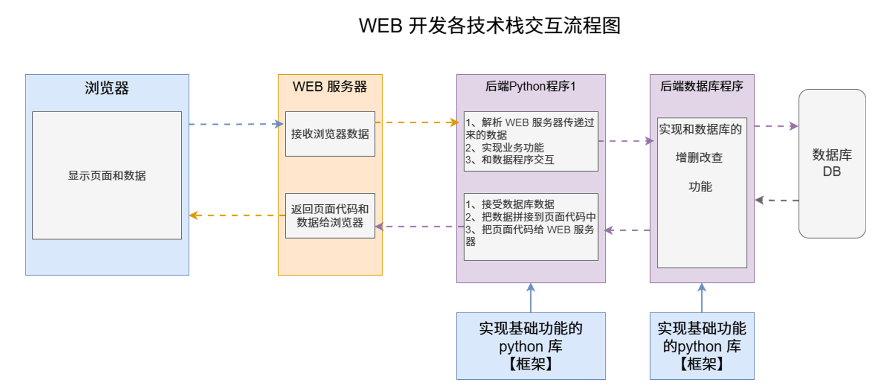

## 一.了解Web框架
- 什么是Web程序？（前端、后端和数据库的完整的协作体系）
- 网络程序交互三要素的作用是什么？
- 掌握本地搭建web服务
- Django全栈框架的作用？
- MVC和MVT架构的差异，对比分析主流框架的设计思想
- ai工具可以辅助开发操作
#### 1. web开发需要的技术
1. 前端技术（html、css、javascript、模板引擎【把后端数据自动填充到前端代码，不用手动拼接】)
2. web服务器（接受浏览器数据，反馈浏览器数据）
3. 核心框架（Django浏览器和程序交互和程序和数据库交互、Flack仅有浏览器和程序交互）
4. 数据库对接：ORM工具（Django内置）


#### 2.web开发

- IP地址 互联网协议地址（IP4 `192.168.65.100`、IP6 `ABCD:EF01:2345:6789:ABCD:EF01:2345:6789`） 
  - 域名:映射到某个IP的英文单词组合就是域名（个人起的名） 
  - 本机地址：127.0.0.1、localhost 

```bash
  ipconfig
  ping www.baidu.com
```

- 端口号（软件之间的唯一标识）（它的取值范围是 0~65535。中，0~1023之间的端口号用于一些知名的网络服务和应用，普通的应用程序需要使用 1024 以上的端口号）
- 通信协议（设备沟通的标准准则）
  - HTTP请求数据格式
    - 请求首行：http版本，当前请求的方式
    - 请求头：一大堆键值对行
    - 请求体：get没有 post有
  - HTTP响应数据格式
    - 响应首行：标识http版本，响应状态码
    - 响应头
    - 响应体：返回的浏览器数据 

#### 3.搭建web服务器
- 构建服务器端
- 接收客户端（浏览器）请求的数据
- 给客户端反馈数据
  - 处理响应行和响应头
  - 处理不同访问路径反馈不同内容问题
- 连接MySQL获取数据库数据
 
```bash
import socket
#1.创建服务器
s = socket.socket()
s.bind('127.0.0.1',8001)
s.listen(5)
while Ture:
  conn,addr=s.accept()
  #2.接受客户端请求
  data = conn.recv(1024)
  # print(data)
  #3.给客户端返回数据
  #处理响应行和响应头
  conn.send(b'HTTP/1.1 200 OK \r\n')#拼接响应的三行，让浏览器帮我们补充
  conn.send(b'Content-Type: text/html; charset=utf-8 \r\n\r\n')
  conn.send(b'holle world!')#只能以二进制的方式传给浏览器
#关闭连接
conn.close()

```
