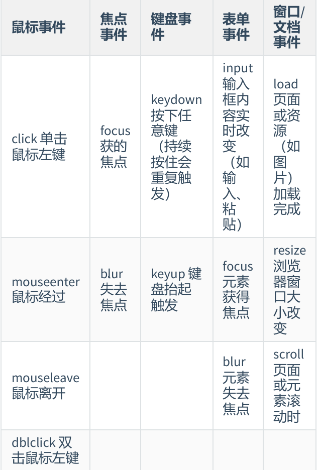

## 变量和数据类型
- JavaScript 客户端部署语言 当前比较流行的语言
- 部署时有两种方法
  - 直接写在前端代码中
  ```bash
    <script>
       alert('这是一个弹窗！')
    <script/>
  ```
  - 写在.js文件里
  ```bash
    <script str=""><script/>
  ```
### 1.变量
- 声明和赋值的语法和python的语法相同（let）
- 常量声明（const）
### 2.数据类型（分为原始类型和对象类型）
- 原始类型（数字，字符串，布尔值，null空值，unfinished未定义）
  - 字符串（其中与python的不同点）`console.log("my name is ${name}")`
  - null空值 赋值了但内容为空`let a=""`
  - unfinished未定义 没有赋值的变量的数据类型
- 对象类型（object对象.array数组,function函数）
  - 数组的操作方法
  - | 增 | 删 | 改 | 查 |
    | :---: | :---: | :---: | :---: |
    | array.push() | delete array[] | array.splice(start,num,itme) | console.log(array[]) (也可以直接查看整个数组) |
### 3.转换
- 隐性转换 +两边只要有一个数据类型是字符串那么结果是两个字符串相加、-/*的话都会把数据转化为数字类型
- 显性转换 Number() parseInt() parseFloat() string() 
---
## 判断，循环，函数
### 1.判断
- 判断（包括逻辑运算和比较运算）（===表示两边的值和类型都相等、其他的符号都与python语法相同）
- 条件判断（if else）
### 2.循环
- while
- for（遍历数组）
- break和contine关键字
### 3.函数
- 系统函数`console.log() parseInt()`
- 自定义函数`function 函数名(实参){}`
- 匿名函数`let fn=function(实参){}`
- 箭头函数`let fn=(实参)=>{}`
- 高阶函数(接受另一个函数作为参数)
  - filter数组过滤
  ```bash
    let array=[1,2,3,4]
    const new=array.filter(function(num){
      return num%2
    })
    console.log(new)
  ```
  - foreach数组遍历
  ```bash
    let a=[1,2,3,4]
    a.forEach(function(num){
    console.log(num)
    })
  ```
  ---
## 对象、DOM操作
### 1.对象（无序的）
```bash
  let a={
    name:"吉祥",
    "now-age":19
    age:18,
    gender:"男"
    hi:function(){
      console.log('欢迎！')
    }
  }
```
| 增 | 删 | 改 | 查 |
| :---: | :---: | :---: | :---: |
| object.height(属性：值) | delete object.属性 | object.属性=值  object['属性']=值|console.log(object.属性) |
- 遍历对象
```bash
for(let k in a){
  console.log(a[k])
}
```
### 2.DOM操作（核心思想是把网页当作对象来处理）
- 什么是DOM（DOM是html与javascript之间的'翻译官'，充当一个接口的作用）
  - 浏览器会根据html标签生成js对象（修改对象的属性会自动映射到标签上）
  - document是DOM里的一个对象，网页的元素都在document里
- 获取DOM元素
  - `document.querySelector('CSS选择器')`
  - 补充伪元素（有索引号，但没有pop()、push()等函数方法）`document.querySeletorAll('CSS选择器')`
- 操作元素内容
  - innertext将文本内容添加到标签位置
  - innerHTML将文本内容添加到标签位置同时可以解析网页标签（如加粗<strong><strong/>）
- 事件监听（绑定）
```bash
const object=document.querySelect('CSS选择器')
objext.addEleventLIstener('click',function(){alert('这是一个弹窗！')})
```
- 事件类型<br>
  <br>
- 事件对象（相当于事件触发之后，浏览器塞给你的一个对象'信息包'）
  - type(触发的事件类型) clientX/Y(鼠标距离浏览器左上角的坐标) offsetX/Y(相对事件标签)`object.addEvenListener('keydown',function(e){console.log(e.key)})`
